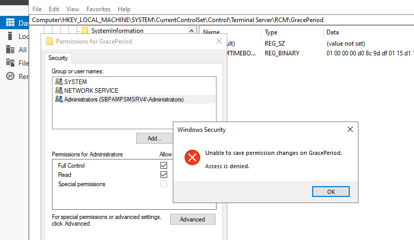

# How to Remove RDP License Issue on Windows Server

This method helped resolve the **Remote Desktop licensing issue** on one of our Windows Server machines. Follow the steps below carefully.

---

### 🛠 Steps

1. **Open Registry Editor**  
   Press `Win + R`, type `regedit`, and press `Enter`.

2. **Navigate to the following path**:
Computer\HKEY_LOCAL_MACHINE\SYSTEM\CurrentControlSet\Control\Terminal Server\RCM\GracePeriod

3. **Modify Permissions on `GracePeriod`**:
- Right-click on the `GracePeriod` folder.
- Select **Permissions**.
- Click **Advanced**.
- Click the **Change** button next to the **Owner: SYSTEM**.
- Set the owner to **Administrators**, apply, and OK.

4. **Grant Full Control**:
- Back in the Permissions window, give **Administrators** **Full Control**.
-  If you encounter **"Access Denied"**, repeat the steps above to ensure proper permissions.

- under permission go to advanced and click on change button infront of  owner : SYSTEM      and select user like Administrator 
then applay and ok 
5. **Delete the Key**:
- On the right side of the `GracePeriod` folder, delete the key shown (usually a binary key).

6. **Restart the Server**:
- Restart the Windows Server to apply the changes.

---

✅ This method resolved the RDP license issue for us on one of our servers.

> **Disclaimer**: Editing the registry can be risky. Always back up the registry before making changes.

